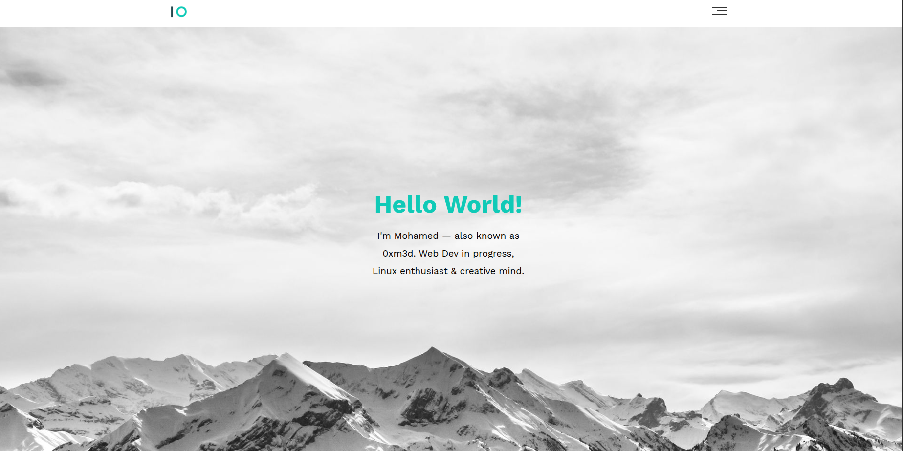
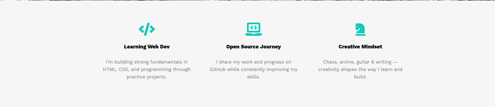
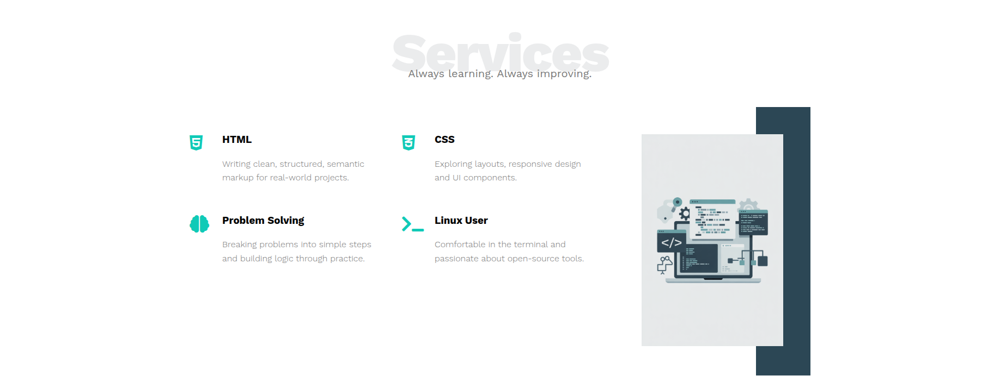
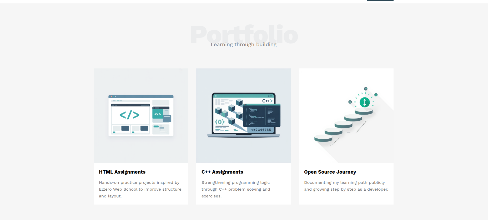
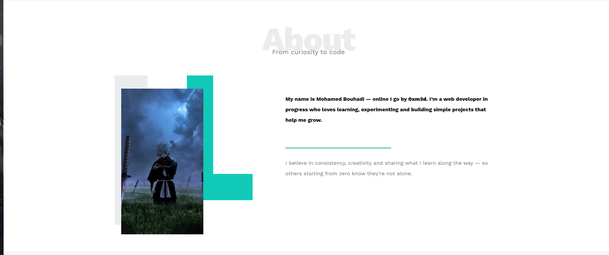
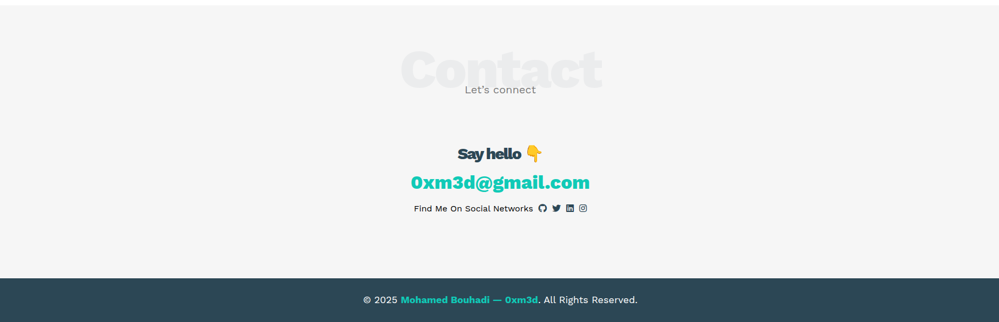

<h1 align="center">🎨 Leon Portfolio Template</h1>
<p align="center">
  A sleek, modern portfolio website built from the <strong>Leon HTML Agency Template</strong>, fully responsive and ready to showcase your work! 🚀
</p>

---

<p align="center">
  <a href="https://0xm3d.github.io/leon-template/">
    
  </a>
  <a href="https://github.com/0xm3d/leon-template">
    
  </a>
</p>

---

## 🛠 Built With
- 
- 
- 
- 

---

## ✨ Features
- Fully **responsive layout** – works on desktop, tablet, and mobile  
- Hero section with **eye-catching header and call-to-action**  
- Sections for **About, Features, Services, Portfolio, and Contact**  
- **Font Awesome icons** for sleek visuals  
- Smooth **animations & hover effects**  
- Inspired by the [Leon HTML Agency Template](https://www.graphberry.com/item/leon-html-agency-template)  
- **Creative and modern design elements** to make your portfolio shine 🌟  
- Built as part of **[Elzero Web School](https://www.youtube.com/playlist?list=PLDoPjvoNmBAzHSjcR-HnW9tnxyuye8KbF)** HTML & CSS course 💻

---

## 📂 Project Structure
```
leon-template/
├─ index.html          # Main landing page
├─ css/
│  ├─ style.css        # Custom styles
│  └─ normalize.css    # Cross-browser reset
├─ fonts/              # Font Awesome icons
├─ img/                # Images and portfolio assets
├─ screenshots/        # Screenshots of the site
└─ README.md           # Project documentation
```

---

# 📸 Screenshots

### 🏡 Landing Section
<p align="center">
  
</p>

### ⚡ Features Section
<p align="center">
  
</p>

### 🛎️ Services Section
<p align="center">
  
</p>

### 💼 Portfolio Section
<p align="center">
  
</p>

### 👤 About Section
<p align="center">
  
</p>

### 📬 Contact Section
<p align="center">
  
</p>

---

## 📧 Contact & Socials
Connect with me and follow my work:  
[](https://github.com/0xm3d)  
[](https://x.com/0xm3d)  
[](https://instagram.com/0xm3d)

---

<p align="center">
  Made with ❤️ and a passion for creative, modern web design! ✨  
</p>
